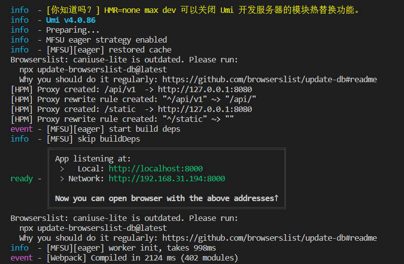
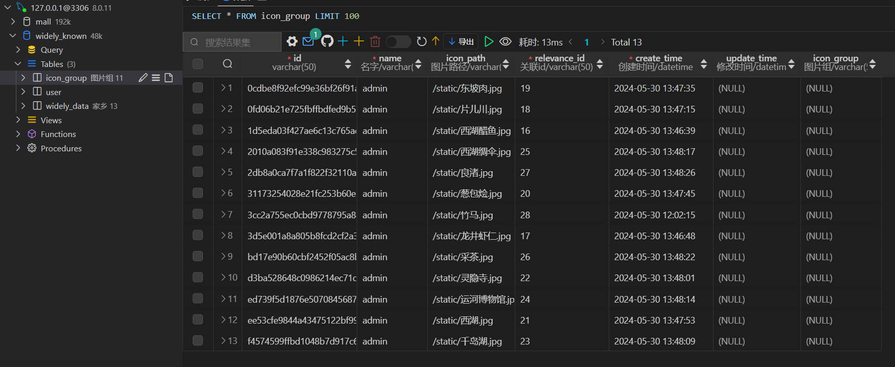
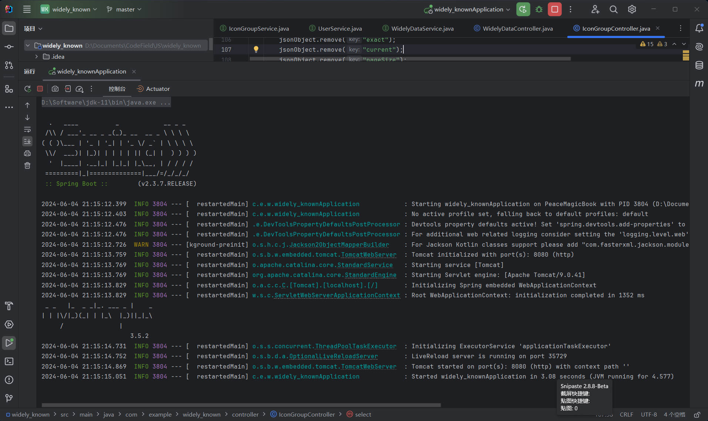

# 启动项目

- 所需环境：NodeJs、Vue、maven、JDK11、MySQL、VSCode、tomcat
- 建议安装：Git（代码管理）、Navicat或者dBeaver（数据库管理），VSCode可以使用MYSQL插件

备注：
nodejs版本v16.20.2 JDK11
以上环境在设置环境变量时需要将文件夹权限全部打开，以免遇到麻烦。教程网上都比较全。

## 前端

项目[widely_data](https://github.com/TomiokapEace/widely_data)

请确保安装配置好了NodeJs环境，并在`widely_data`文件夹下输入`npm install`命令，安装所需依赖，随后运行`npm run dev`命令，启动前端。

若终端出现以下信息，并且能在浏览器中成功显示[http://localhost:8080/](http://localhost:8000/)页面，说明前端启动成功

## 后端

请确保安装配置好了NodeJs、Vue、maven、JDK11、MySQL、tomcat、idea

1. 配置数据库

powershell运行`widely_known`文件夹下的.sql文件，直接建表，通过数据库管理软件查看数据库。应当有这些数据表（三个），且每个数据表中都应有相关数据。

2. 加载所需依赖、启动后端服务

依赖已上传，环境配置无误后，项目可在idea中直接运行。终端出现以下图片说明后端开始运行。

## 验证

另建终端运行前端。

未运行前端的话，重新进入到`widely_data`文件夹下运行`npm run dev`启动前端。

此时可以返回前端的网页，随便点点看看是否能够操作成功。

默认管理员用户名同密码：admin

点击登录后出现首页

## 项目架构

## 系统功能设计

## 数据库连接池

内嵌的Tomcat作为Servlet容器

## 数据库表设计

## 展望

系统可朝着工程性项目发展，增强数据增加的安全性。